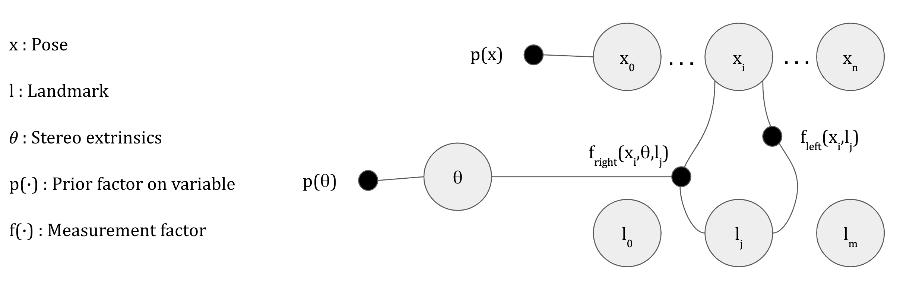

README - Online Stereo Camera Calibration
===================================================

How to run the calibration code?
--------------------------------

The GTSAM setup instruction are given below. After compilation, go to the `build/examples` folder and run `StereoSelfCalibrationAPI`. The script requires an experiment name, an experiment ID and a mode parameter which can be either 'rot' (optimize only for extrinsic rotations) or 'pose' (optimize for the full extrinsic pose). This will create a folder by that name with the results specified by the ID. For example:

```
./StereoSelfCalibrationAPI trial_exp 1 rot
```
The above command will create a folder `trial_exp` with 2 files.
`error_1.txt` which contains 7 lines. The first 6 are calibration errors for the extrinsics (yaw, pitch, roll, x, y, z respectively) and the last value is the average no of features seen from each pose.
`result_1.txt` which contains 6 estimated extrinsic parameter values (yaw, pitch, roll, x, y, z respectively) for the final frame.

By default, the data for the calibration is picked up from [`examples/Data/StereoSelfCalibration/`](examples/Data/StereoSelfCalibration/) folder. All these files are space separated values of poses (in the order yaw, pitch, roll, x, y, z) in radians/meters or landmarks (in the order x, y, z) in meters. There are 5 files, namely the feature points, the ground truth pose, the deviated pose (to simulate noisy odometry measurements), stereo extrinsic ground truth pose and deviated extrinsic pose. They currently have dummy values.

The executable also accepts the paths of the 5 files mentioned above as command line arguments:

```
./StereoSelfCalibrationAPI trial_exp 1 rot feature_filepath pose_filepath pose_deviated_filepath extrinsic_filepath extrinsic_deviated_filepath
```

In case someone wants to modify a part of the code, the main script is here: [`examples/StereoSelfCalibrationAPI.cpp`](examples/StereoSelfCalibrationAPI.cpp)

Factor graph model used
-----------------------




What is GTSAM?
--------------

GTSAM is a library of C++ classes that implement smoothing and
mapping (SAM) in robotics and vision, using factor graphs and Bayes
networks as the underlying computing paradigm rather than sparse
matrices.

On top of the C++ library, GTSAM includes a MATLAB interface (enable
GTSAM_INSTALL_MATLAB_TOOLBOX in CMake to build it). A Python interface
is under development.

Quickstart
----------

In the root library folder execute:

```
#!bash
$ mkdir build
$ cd build
$ cmake ..
$ make check (optional, runs unit tests)
$ make install
```

Prerequisites:

- [Boost](http://www.boost.org/users/download/) >= 1.43 (Ubuntu: `sudo apt-get install libboost-all-dev`)
- [CMake](http://www.cmake.org/cmake/resources/software.html) >= 3.0 (Ubuntu: `sudo apt-get install cmake`)
- A modern compiler, i.e., at least gcc 4.7.3 on Linux.

Optional prerequisites - used automatically if findable by CMake:

- [Intel Threaded Building Blocks (TBB)](http://www.threadingbuildingblocks.org/) (Ubuntu: `sudo apt-get install libtbb-dev`)
- [Intel Math Kernel Library (MKL)](http://software.intel.com/en-us/intel-mkl)

GTSAM 4 Compatibility
---------------------

GTSAM 4 will introduce several new features, most notably Expressions and a python toolbox. We will also deprecate some legacy functionality and wrongly named methods, but by default the flag GTSAM_ALLOW_DEPRECATED_SINCE_V4 is enabled, allowing anyone to just pull V4 and compile. To build the python toolbox, however, you will have to explicitly disable that flag.

Also, GTSAM 4 introduces traits, a C++ technique that allows optimizing with non-GTSAM types. That opens the door to retiring geometric types such as Point2 and Point3 to pure Eigen types, which we will also do. A significant change which will not trigger a compile error is that zero-initializing of Point2 and Point3 will be deprecated, so please be aware that this might render functions using their default constructor incorrect.

The Preintegrated IMU Factor
----------------------------

GTSAM includes a state of the art IMU handling scheme based on

- Todd Lupton and Salah Sukkarieh, "Visual-Inertial-Aided Navigation for High-Dynamic Motion in Built Environments Without Initial Conditions", TRO, 28(1):61-76, 2012.

Our implementation improves on this using integration on the manifold, as detailed in

- Luca Carlone, Zsolt Kira, Chris Beall, Vadim Indelman, and Frank Dellaert, "Eliminating conditionally independent sets in factor graphs: a unifying perspective based on smart factors", Int. Conf. on Robotics and Automation (ICRA), 2014.
- Christian Forster, Luca Carlone, Frank Dellaert, and Davide Scaramuzza, "IMU Preintegration on Manifold for Efficient Visual-Inertial Maximum-a-Posteriori Estimation", Robotics: Science and Systems (RSS), 2015.

If you are using the factor in academic work, please cite the publications above.

In GTSAM 4 a new and more efficient implementation, based on integrating on the NavState tangent space and detailed in docs/ImuFactor.pdf, is enabled by default. To switch to the RSS 2015 version, set the flag **GTSAM_TANGENT_PREINTEGRATION** to OFF.


Additional Information
----------------------

There is a [`GTSAM users Google group`](https://groups.google.com/forum/#!forum/gtsam-users) for general discussion.

Read about important [`GTSAM-Concepts`](GTSAM-Concepts.md) here. A primer on GTSAM Expressions,
which support (superfast) automatic differentiation,
can be found on the [GTSAM wiki on BitBucket](https://bitbucket.org/gtborg/gtsam/wiki/Home).

See the [`INSTALL`](INSTALL.md) file for more detailed installation instructions.

GTSAM is open source under the BSD license, see the [`LICENSE`](LICENSE) and [`LICENSE.BSD`](LICENSE.BSD) files.

Please see the [`examples/`](examples) directory and the [`USAGE`](USAGE.md) file for examples on how to use GTSAM.

GTSAM was developed in the lab of [Frank Dellaert](http://www.cc.gatech.edu/~dellaert) at the [Georgia Institute of Technology](http://www.gatech.edu), with the help of many contributors over the years, see [THANKS](THANKS).
